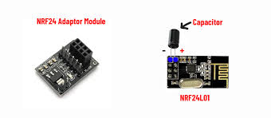
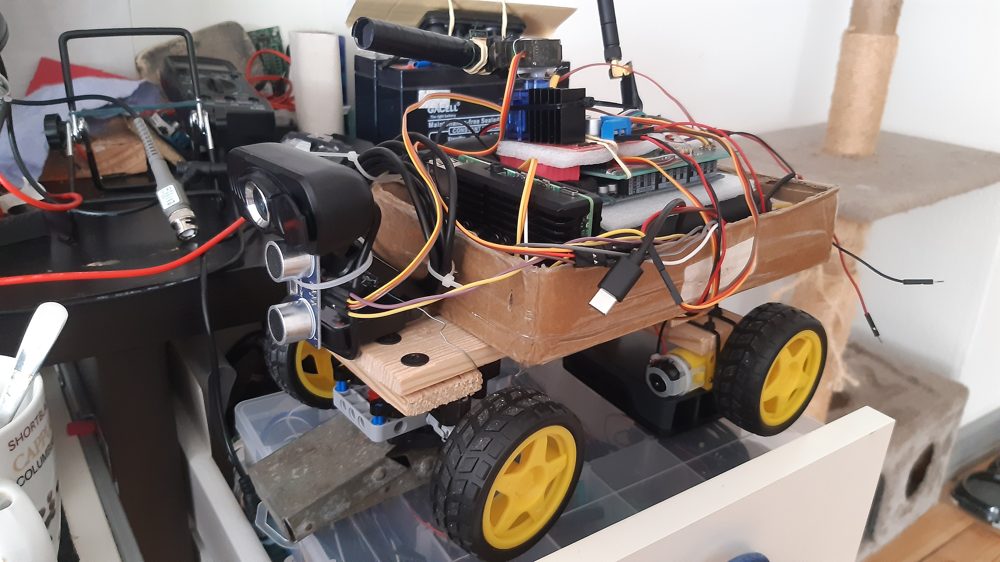
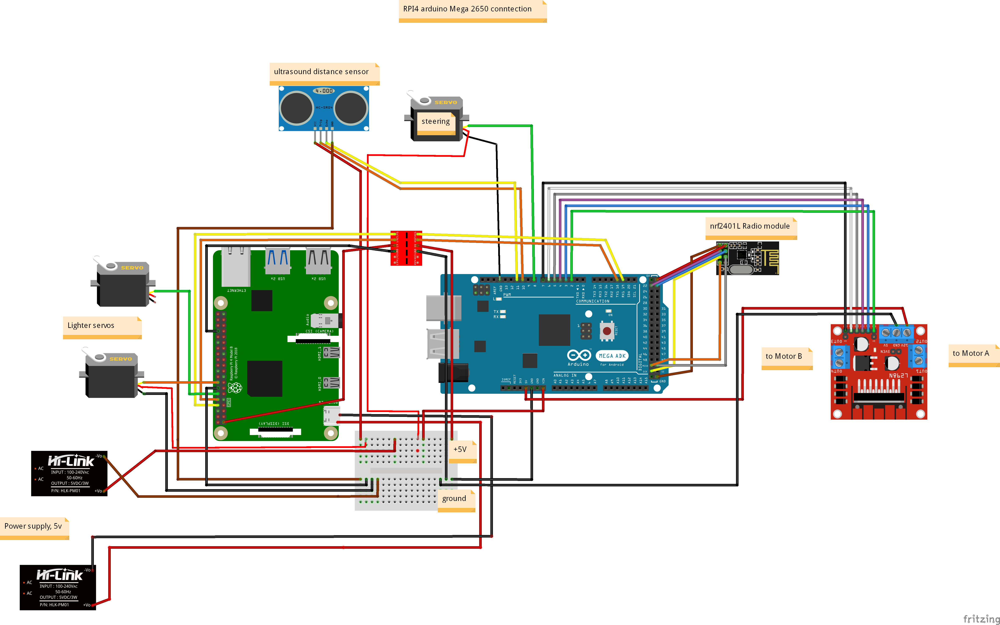

# RC car with ML model on board

Arduino hardware driven car with remote control with nRF01L+LNA modules.

Aim:  
Develop pet project to study new things and open new horizonts 
in robotics and machine learning.

List of materials:
 - Arduino Mega 2560
 - L298N motors driver
 - servos s90g
 - radio module nRF24L01+LNA, 2.4 GHz
 - Arduino nano
 - Arduino joystick
 - Raspberry Pi4, 2 Gb RAM, Debian 12/64

## Project flow:
- test radio module for compatibility with each other
- design transmitter
- design receiver part
- attempts to train ML learning model with TensorFlow, Yolo, Edge Impulse
- test opencv lib on pc with C++
- move opencv to raspberry Pi4
- connect raspberry Pi4 with servo via gpio 
- connect raspberry Pi4 with atmega 2560
- train and deploy Edge impulse model on raspberry Pi4
- test the car for bugs

### nRF01L+LNA

Might be a pain in the ass due to its features. But its prices, speed changes everything.  
To avoid problems with connectivity highly recommended to read official documentation,  
the is troubleshooting paragraph.
Recommended to solder capacitor to 5V and gnd pins on radio module to reduce noice
Recommended to check radio space for radio noice source (microwave, mobile, bt, wifi devices)  
and set right channel for broadcast.
Recomended to use adaptor to avoid misconneption with 5v instead of 3.3v.

  

### Transmitter

Straitforward design with Arduino nano board, 2 joysticks for x and y representation and radio module to  
transmit data.

  

### Receiver

More complicated due to variety of tasks. Atmega 2560 has to receive a data from transmitter, process it  
and pass values to servo (stearing control access data from y-transmitter-joystick) and to wheels  
(x data from transmitter).
More over, here was established the UART connection between raspberry Pi4 and atmega2560, Serial1 is assigned. 
Also was embedded ultrasonic distance sensor to stop car in obstacles cases.

### Train ML learning model with TensorFlow, Yolo, Edge Impulse

The best result for performance was achieved with edgeimpulse. Minimum latency, ~ 15 fps, in that same time  
with yolov5.tflite model was achieved above ~ 1fps.
To train model with Tensorflow was unsuccessful due to its dependencies incompatibility, confused documentation 
regarding edge devices.

### Test opencv lib on pc with C++
To make a test with OpenCV lib and C++ was written a straightforward script which reads off video from  
laptop webcam, processes it with opencv and haardcascade face recognition and pass data via serial communication  
to arduino board to move servoes. 

### Move opencv to raspberry Pi4

It is possible to use python based opencv lib and C++ lib. 
Easier way is with python. First of all, opencv lib originally is written on C++, python lib is just a bridge,  
way to use it in python projects. Secondly, The speed of all process is being determinated with image processing,
that related of hardware performance.

### Connect raspberry Pi4 with peripheries
It is possible with enabling of hardware gpio pins and uart communication in raspi-config

### Train and deploy Edge impulse model on raspberry Pi4
There is well organized documentation and guidance on Edge Impulse web page. 
Just follow their instruction how to do everything step by step. There are possibilities to collect data,  
train model directly on their server and check it performance directly with web browser on mobile, laptop  
via internet having not downloaded it.
But it is paid service, is free for small size projects
A link to the Edge Impulse guidance is [here](https://docs.edgeimpulse.com/docs/tutorials/end-to-end-tutorials/computer-vision/object-detection/detect-objects-using-fomo)
.
How to deploy ML model on the Raspberry Pi4 board is well described [here](https://docs.edgeimpulse.com/docs/edge-ai-hardware/cpu/raspberry-pi-4)

### Test the car for bugs
Deploying on raspberry Pi4 board occurs as it is described on their documentation. Script downloads sdk for  
python together with ML model.
Among generated py files there is file classify.py which is responsible for object recognition and classification
and it is ready to use, but we can modify it in desirable way according to our needs. 
There was noticed, usage of RPI4 demands a separate power source or some type of amplifier.  
It can not take a voltage fluctuation and needs at least 2A of current. That's why was decided to  
use 2 power supplies.
There was an issue wtih serial communication between RPI4 and atmega 2560. 
Initially has been tryed to use struct lib and pass data as struct packages, but it did not  
work in that way, was used transmitting as string, it worked pretty well.
There was an issue with servoes jitter, connected to the RPI4. It was solved with usage of  
gpiozero library.

### Result is here on video:

